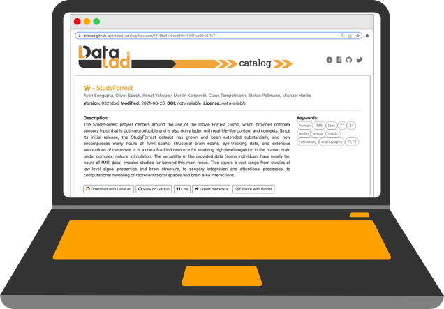
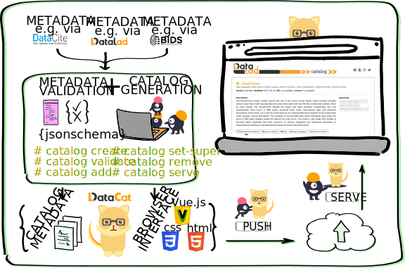
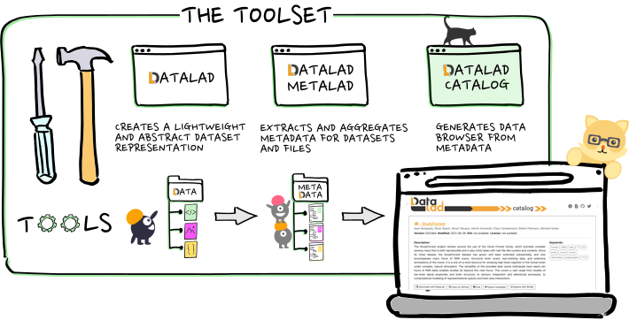

[](http://docs.datalad.org/projects/catalog/en/latest/?badge=latest)
[](https://GitHub.com/datalad/datalad-catalog/releases/)
[](https://pypi.python.org/pypi/datalad-catalog/)
[](https://github.com/datalad/datalad-catalog/actions/workflows/docbuild.yml)
[](https://ci.appveyor.com/project/mih/datalad-catalog/branch/main)
[](https://codecov.io/github/datalad/datalad-catalog?branch=main)
[](https://github.com/datalad/datalad-catalog/actions/workflows/test_crippledfs.yml)
[](https://github.com/datalad/datalad-catalog/actions/workflows/pages/pages-build-deployment)
[](https://github.com/datalad/datalad-catalog/actions/workflows/deploy_demo.yml)
[](https://zenodo.org/badge/latestdoi/371040885)
<!-- ALL-CONTRIBUTORS-BADGE:START - Do not remove or modify this section -->
[](#contributors-)
<!-- ALL-CONTRIBUTORS-BADGE:END -->


<picture>
  <source media="(prefers-color-scheme: light)" srcset="docs/source/_static/datacat0_hero.svg">
  <source media="(prefers-color-scheme: dark)" srcset="docs/source/_static/datacat0_hero_lightbg.svg">
  
</picture>

<br>

DataLad Catalog is a free and open source command line tool, with a Python API, that assists with the automatic generation of user-friendly, browser-based data catalogs from structured metadata. It is an extension to [DataLad](https://datalad.org) and forms part of the broader ecosystem of DataLad's distributed metadata handling and (meta)data publishing tools.

### Acknowledgements

This software was developed with support from the German Federal Ministry of
Education and Research (BMBF 01GQ1905), the US National Science Foundation
(NSF 1912266), and the Deutsche Forschungsgemeinschaft (DFG, German Research
Foundation) under grant SFB 1451 ([431549029](https://gepris.dfg.de/gepris/projekt/431549029),
INF project).

## 1. Online demo

Navigate to [https://datalad.github.io/datalad-catalog/](https://datalad.github.io/datalad-catalog/) to view a live demo of a catalog generated with DataLad Catalog.

This demo site is hosted via GitHub Pages and it builds from the `gh-pages` branch of this repository.

<div style="text-align:center;">
    </img>
</div>

## 2. How it works

DataLad Catalog can receive commands to `create` a new catalog, `add` and `remove` metadata entries to/from an existing catalog, `serve` an existing catalog locally, and more. Metadata can be provided to DataLad Catalog from any number of arbitrary metadata sources, as an aggregated set or as individual metadata items. DataLad Catalog has a dedicated [schema](https://datalad.github.io/datalad-catalog/display_schema) (using the [JSON Schema](https://json-schema.org/) vocabulary) against which incoming metadata items are validated. This schema allows for standard metadata fields as one would expect for datasets of any kind (such as `name`, `doi`, `url`, `description`, `license`, `authors`, and more), as well as fields that support identification, versioning, dataset context and linkage, and file tree specification.

The process of generating a catalog, after metadata entry validation, involves:
1. aggregation of the provided metadata into the catalog filetree, and
2. generating the assets required to render the user interface in a browser.

The output is a set of structured metadata files, as well as a [Vue.js](https://vuejs.org/)-based browser interface that understands how to render this metadata in the browser. What is left for the user is to host this content on their platform of choice and to serve it for the world to see.

<br>
<div style="text-align:center;">
  <picture>
    <source media="(prefers-color-scheme: light)" srcset="docs/source/_static/datacat4_the_catalog.svg">
    <source media="(prefers-color-scheme: dark)" srcset="docs/source/_static/datacat4_the_catalog_lightbg.svg">
    </img>
  </picture>
</div>


## 3. Install `datalad-catalog`

### Step 1 - Setup and activate virtual environment

With your virtual environment manager of choice, create a virtual environment and ensure
you have a recent version of Python installed. Then activate the environment. E.g. with `venv`:

```
python -m venv my_catalog_env
source my_catalog_env/bin/activate
```

### Step 2 - Install the package from PyPI

Run the following from your command line:

```
pip install datalad-catalog
```

If you are a developer and would like to contribute to the code, instead clone the code base from GitHub and install with `pip` local changes :

```
git clone https://github.com/datalad/datalad-catalog.git
cd datalad-catalog
pip install -e .
```

Congratulations! You have now installed `datalad-catalog`.

#### Note on dependencies:

Because this is an extension to `datalad` and builds on metadata handling functionality, the installation process also installs [`datalad`](https://github.com/datalad/datalad) and [`datalad-metalad`](https://github.com/datalad/datalad-metalad) as dependencies, although these do not have to be used as the only sources of metadata for a catalog.

While the catalog generation process does not expect data to be structured as DataLad datasets, it can still be very useful to do so when building a full (meta)data management pipeline from raw data to catalog publishing. For complete instructions on how to install `datalad` and `git-annex`, please refer to the [DataLad Handbook](https://handbook.datalad.org/en/latest/intro/installation.html).

Similarly, the metadata input to `datalad-catalog` can come from any source as long as it conforms to the catalog schema. While the catalog does not expect metadata originating only from `datalad-metalad`'s extractors, this tool has advanced metadata handling capabilities that will integrate seamlessly with DataLad datasets and the catalog generation process.


## 4. Generating a catalog

The overall catalog generation process actually starts several steps before the involvement of `datalad-catalog`. Steps include:

1. curating data into datasets (a group of files in an hierarchical tree)
2. adding metadata to datasets and files (the process for this and the resulting metadata formats and content vary widely depending on domain, file types, data availability, and more)
3. extracting the metadata using an automated tool to output metadata items into a standardized and queryable set
4. in the current context: translating the metadata into the [catalog schema](https://datalad.github.io/datalad-catalog/display_schema)
5. in the current context: using `datalad-catalog` to generate a catalog from the [schema-conforming metadata](https://datalad.github.io/datalad-catalog/display_schema)

The first four steps in this list can follow any arbitrarily specified procedures and can use any arbitrarily specified tools to get the job done. If these steps are completed, correctly formatted data can be input, together with some configuration details, to `datalad-catalog`. This tool then provides several basic commands for catalog generation and customization. *For example:*

```bash

datalad catalog validate -m <path/to/input/data>
# Validate input data located at <path/to/input/data> according to the catalog's schema.

datalad catalog create -c <path/to/catalog/directory> -m <path/to/input/data>
# Create a catalog at location <path/to/catalog/directory>, using input data located at <path/to/input/data>.

datalad catalog add -c <path/to/catalog/directory> -m <path/to/input/data>
# Add metadata to an existing catalog at location <path/to/catalog/directory>, using input data located at <path/to/input/data>.

datalad catalog set-super -c <path/to/catalog/directory> -i <dataset_id> -v <dataset_version>
# Set the superdataset of an existing catalog at location <path/to/catalog/directory>, where the superdataset id and version are provided as arguments. The superdataset will be the first dataset displayed when navigating to the root URL of a catalog.

datalad catalog serve -c <path/to/catalog/directory>
# Serve the content of the catalog at location <path/to/catalog/directory> via a local HTTP server.

datalad catalog workflow-new -c <path/to/catalog/directory> -d <path/to/superdataset>
# Run a workflow for recursive metadata extraction (using datalad-metalad), translating metadata to the catalog schema (using JQ bindings), and adding the translated metadata to a new catalog.

datalad catalog workflow-update -c <path/to/catalog/directory> -d <path/to/superdataset> -s <path/to/subdataset>
# Run a workflow for updating a catalog after registering a subdataset to the superdataset which the catalog represents. This workflow includes extraction (using datalad-metalad), translating metadata to the catalog schema (using JQ bindings), and adding the translated metadata to the existing catalog.
```

<div id="tutorial"><div>

## 5. Tutorial

To explore the basic functionality of `datalad-catalog`, please refer to [these tutorials](https://github.com/datalad/tutorials/tree/master/notebooks/catalog_tutorials#readme).


## 6. An example workflow

The DataLad ecosystem provides a complete set of free and open source tools that, together, provide full control over dataset/file access and distribution, version control, provenance tracking, metadata addition/extraction/aggregation, and catalog generation. 

DataLad itself can be used for decentralised management of data as lightweight, portable and extensible representations. DataLad MetaLad can extract structured high- and low-level metadata and associate it with these datasets or with individual files. And at the end of the workflow, DataLad Catalog can turn the structured metadata into a user-friendly data browser.

Importantly, DataLad Catalog can operate independently as well. Since it provides its own [schema](https://datalad.github.io/datalad-catalog/display_schema) in a standard vocabulary, any metadata that conforms to this schema can be submitted to the tool in order to generate a catalog. Metadata items do not necessarily have to be derived from DataLad datasets, and the metadata extraction does not have to be conducted via DataLad MetaLad.

Even so, the provided set of tools can be particularly powerful when used together in a distributed (meta)data management pipeline.

<br>
<div style="text-align:center;">
  <picture>
    <source media="(prefers-color-scheme: light)" srcset="docs/source/_static/datacat3_the_toolset.svg">
    <source media="(prefers-color-scheme: dark)" srcset="docs/source/_static/datacat3_the_toolset_lightbg.svg">
    </img>
  </picture>
</div>


## 7. Contributing

### Feedback / comments

Please [create a new issue](https://github.com/jsheunis/data-browser-from-metadata/issues/new) if you have any feedback, comments, or requests.

### Developer requirements

If you'd like to contribute as a developer, you need to install a number of extra dependencies:

```
cd datalad-catalog
pip install -r requirements-devel.txt
```

This installs `sphinx` and related packages for documentation building, `coverage` for code coverage, and `pytest` for testing.

### Contribution process

To make a contribution to the code or documentation, please:

- create an issue describing the bug/feature
- fork the project repository,
- create a branch from `main`,
- check that tests succeed: from the project root directory, run `pytest`
- commit your changes,
- push to your fork
- create a pull request with a clear description of the changes

## Contributors ✨

Thanks goes to these wonderful people ([emoji key](https://allcontributors.org/docs/en/emoji-key)):

<!-- ALL-CONTRIBUTORS-LIST:START - Do not remove or modify this section -->
<!-- prettier-ignore-start -->
<!-- markdownlint-disable -->
<table>
  <tr>
    <td align="center"><a href="https://jsheunis.github.io/"><br /><sub><b>Stephan Heunis</b></sub></a><br /><a href="https://github.com/datalad/datalad-catalog/issues?q=author%3Ajsheunis" title="Bug reports">🐛</a> <a href="https://github.com/datalad/datalad-catalog/commits?author=jsheunis" title="Code">💻</a> <a href="#content-jsheunis" title="Content">🖋</a> <a href="#data-jsheunis" title="Data">🔣</a> <a href="https://github.com/datalad/datalad-catalog/commits?author=jsheunis" title="Documentation">📖</a> <a href="#design-jsheunis" title="Design">🎨</a> <a href="#ideas-jsheunis" title="Ideas, Planning, & Feedback">🤔</a> <a href="#infra-jsheunis" title="Infrastructure (Hosting, Build-Tools, etc)">🚇</a> <a href="#maintenance-jsheunis" title="Maintenance">🚧</a> <a href="https://github.com/datalad/datalad-catalog/commits?author=jsheunis" title="Tests">⚠️</a> <a href="#question-jsheunis" title="Answering Questions">💬</a></td>
    <td align="center"><a href="https://github.com/aqw"><br /><sub><b>Alex Waite</b></sub></a><br /><a href="#data-aqw" title="Data">🔣</a> <a href="#design-aqw" title="Design">🎨</a> <a href="#ideas-aqw" title="Ideas, Planning, & Feedback">🤔</a> <a href="https://github.com/datalad/datalad-catalog/commits?author=aqw" title="Code">💻</a> <a href="#userTesting-aqw" title="User Testing">📓</a> <a href="https://github.com/datalad/datalad-catalog/issues?q=author%3Aaqw" title="Bug reports">🐛</a></td>
    <td align="center"><a href="http://juliankosciessa.eu"><br /><sub><b>Julian Kosciessa</b></sub></a><br /><a href="#userTesting-jkosciessa" title="User Testing">📓</a> <a href="#tutorial-jkosciessa" title="Tutorials">✅</a> <a href="#ideas-jkosciessa" title="Ideas, Planning, & Feedback">🤔</a> <a href="https://github.com/datalad/datalad-catalog/commits?author=jkosciessa" title="Documentation">📖</a> <a href="https://github.com/datalad/datalad-catalog/issues?q=author%3Ajkosciessa" title="Bug reports">🐛</a></td>
    <td align="center"><a href="http://www.adina-wagner.com"><br /><sub><b>Adina Wagner</b></sub></a><br /><a href="https://github.com/datalad/datalad-catalog/commits?author=adswa" title="Documentation">📖</a> <a href="https://github.com/datalad/datalad-catalog/issues?q=author%3Aadswa" title="Bug reports">🐛</a> <a href="https://github.com/datalad/datalad-catalog/commits?author=adswa" title="Code">💻</a> <a href="#design-adswa" title="Design">🎨</a> <a href="#ideas-adswa" title="Ideas, Planning, & Feedback">🤔</a> <a href="#infra-adswa" title="Infrastructure (Hosting, Build-Tools, etc)">🚇</a> <a href="#maintenance-adswa" title="Maintenance">🚧</a> <a href="https://github.com/datalad/datalad-catalog/commits?author=adswa" title="Tests">⚠️</a> <a href="#question-adswa" title="Answering Questions">💬</a></td>
    <td align="center"><a href="http://www.onerussian.com"><br /><sub><b>Yaroslav Halchenko</b></sub></a><br /><a href="#userTesting-yarikoptic" title="User Testing">📓</a> <a href="#ideas-yarikoptic" title="Ideas, Planning, & Feedback">🤔</a></td>
    <td align="center"><a href="http://psychoinformatics.de"><br /><sub><b>Michael Hanke</b></sub></a><br /><a href="#ideas-mih" title="Ideas, Planning, & Feedback">🤔</a></td>
    <td align="center"><a href="https://github.com/bpoldrack"><br /><sub><b>Benjamin Poldrack</b></sub></a><br /><a href="#ideas-bpoldrack" title="Ideas, Planning, & Feedback">🤔</a></td>
  </tr>
  <tr>
    <td align="center"><a href="https://github.com/christian-monch"><br /><sub><b>Christian Mönch</b></sub></a><br /><a href="#ideas-christian-monch" title="Ideas, Planning, & Feedback">🤔</a> <a href="https://github.com/datalad/datalad-catalog/issues?q=author%3Achristian-monch" title="Bug reports">🐛</a> <a href="https://github.com/datalad/datalad-catalog/commits?author=christian-monch" title="Code">💻</a> <a href="https://github.com/datalad/datalad-catalog/commits?author=christian-monch" title="Documentation">📖</a> <a href="https://github.com/datalad/datalad-catalog/commits?author=christian-monch" title="Tests">⚠️</a> <a href="#question-christian-monch" title="Answering Questions">💬</a> <a href="https://github.com/datalad/datalad-catalog/pulls?q=is%3Apr+reviewed-by%3Achristian-monch" title="Reviewed Pull Requests">👀</a> <a href="#design-christian-monch" title="Design">🎨</a></td>
    <td align="center"><a href="https://github.com/mslw"><br /><sub><b>Michał Szczepanik</b></sub></a><br /><a href="https://github.com/datalad/datalad-catalog/issues?q=author%3Amslw" title="Bug reports">🐛</a> <a href="https://github.com/datalad/datalad-catalog/commits?author=mslw" title="Code">💻</a> <a href="https://github.com/datalad/datalad-catalog/commits?author=mslw" title="Documentation">📖</a> <a href="https://github.com/datalad/datalad-catalog/commits?author=mslw" title="Tests">⚠️</a></td>
    <td align="center"><a href="https://github.com/loj"><br /><sub><b>Laura Waite</b></sub></a><br /><a href="#ideas-loj" title="Ideas, Planning, & Feedback">🤔</a> <a href="https://github.com/datalad/datalad-catalog/commits?author=loj" title="Documentation">📖</a></td>
    <td align="center"><a href="http://manukapp.itch.io"><br /><sub><b>Leonardo Muller-Rodriguez</b></sub></a><br /><a href="#userTesting-Manukapp" title="User Testing">📓</a> <a href="https://github.com/datalad/datalad-catalog/pulls?q=is%3Apr+reviewed-by%3AManukapp" title="Reviewed Pull Requests">👀</a></td>
  </tr>
</table>

<!-- markdownlint-restore -->
<!-- prettier-ignore-end -->

<!-- ALL-CONTRIBUTORS-LIST:END -->

This project follows the [all-contributors](https://github.com/all-contributors/all-contributors) specification. Contributions of any kind welcome!
