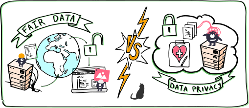
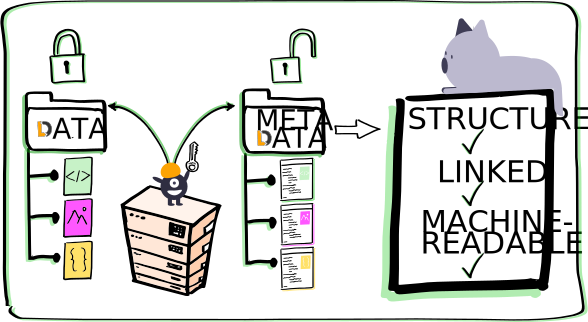
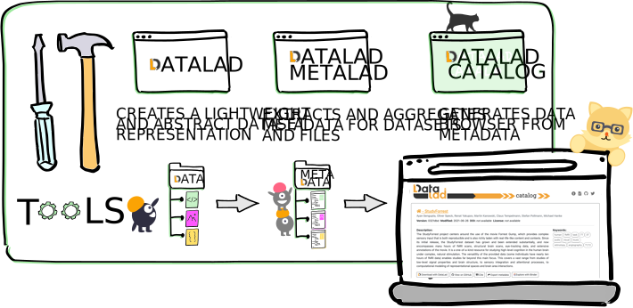
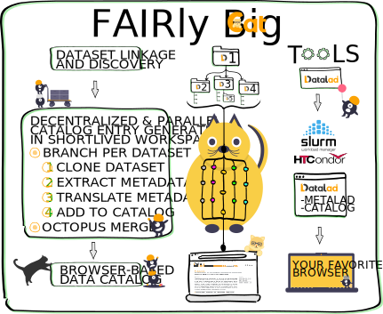

# DataLad Catalog - A primer

    </img>

### Quick Links:

- [DataLad Catalog demo site](https://datalad.github.io/datalad-catalog/)
- [3-minute explainer video](https://www.youtube.com/watch?v=4GERwj49KFc)
- [DataLad Catalog code repository](https://github.com/datalad/datalad-catalog)
- [DataLad Catalog documentation](http://docs.datalad.org/projects/catalog/en/latest/?badge=latest)
- [DataLad website](https://www.datalad.org/)
- [DataLad code repository](https://github.com/datalad/datalad)
- [DataLad MetaLad code repository](https://github.com/datalad/datalad-metalad)

## What is DataLad Catalog?

DataLad Catalog is a free and open source command line tool, with a Python API, that assists with the automatic generation of user-friendly, browser-based data catalogs from structured metadata.

## Why use DataLad Catalog?

Working collaboratively with large and distributed datasets poses particular challenges for FAIR data access, browsing, and usage.

- the **adminstrative burden of keeping track** of different versions of the data, who contributed what, where/how to gain access, and representing this information centrally and accessibly can be significant
- **data privacy regulations** might restrict data from being shared or accessed across multi-national sites
- **costs of centrally maintained infrastructure** for data hosting and web-portal type browsing could be prohibitive

Such challenges impede the many possible gains obtainable from distributed data sharing and access. Decisions might even be made to forego FAIR principles in favour of saving time, effort and money, leading to the view that these efforts have seemingly contradicting outcomes.

    </img>
    
 Fig.1 - The FAIR data vs data privacy contradiction

**DataLad Catalog helps counter this** apparent contadiction by focusing on interoperability with structured, linked, and machine-readable metadata.

Metadata about datasets, their file content, and their links to other datasets can be used to create abstract representations of datasets that are separate from the actual data content. This means that data content can be stored securely while metadata can be shared and operated on widely, thus improving decentralization and FAIRness.

    </img>
    
 Fig.2 - The split between data content and metadata that presents an opportunity to address the challenges to FAIR data access, browsing, and usage.

## How does it work

DataLad Catalog can receive commands to `create` a new catalog, `add` and `remove` metadata entries to/from an existing catalog, `serve` an existing catalog locally, and more. Metadata can be provided to DataLad Catalog from any number of arbitrary metadata sources, as an aggregated set or as individual items/objects. DataLad Catalog has a dedicated schema (using the [JSON Schema](https://json-schema.org/) vocabulary) against which incoming metadata items are validated. This schema allows for standard metadata fields as one would expect for datasets of any kind (such as `name`, `doi`, `url`, `description`, `license`, `authors`, and more), as well as fields that support identification, versioning, dataset context and linkage, and file tree specification.

The process of generating a catalog, after metadata entry validation, involves (1) aggregation of the provided metadata into the catalog filetree, and (2) generating the assets required to render the user interface in a browser. The output is a set of structured metadata files, as well as a [Vue.js](https://vuejs.org/)-based browser interface that understands how to render this metadata in the browser. What is left for the user is to host this content on their platform of choice and to serve it for the world to see.

For an example of the result, visit our [demo catalog](https://datalad.github.io/datalad-catalog/).

    </img>
    
 Fig.3 - A depiction of the catalog generation process

## An example end-to-end pipeline

The DataLad ecosystem provides a complete set of free and open source tools that, together, provide full control over dataset/file access and distribution, version control, provenance tracking, metadata addition/extraction/aggregation, and catalog generation. 

DataLad itself can be used for decentralised management of data as lightweight, portable and extensible representations. DataLad MetaLad can extract structured high- and low-level metadata and associate it with these datasets or with individual files. And at the end of the workflow, DataLad Catalog can turn the structured metadata into a user-friendly data browser.

Importantly, DataLad Catalog can operate independently as well. Since it provides its own schema in a standard vocabulary, any metadata that conforms to this schema can be submitted to the tool in order to generate a catalog. Metadata items do not necessarily have to be derived from DataLad datasets, and the metadata extraction does not have to be conducted via DataLad MetaLad.

Even so, the provided set of tools can be particularly powerful when used together in a distributed (meta)data management pipeline.

    </img>
    
 Fig.4 - The DataLad toolset for decentralized data management, metadata handling, and catalog generation

## Distributed catalog generation

While existing cataloging tools often rely on centralised infrastructure with access to the data, the portability of the DataLad-based toolset allows decentralized and collaborative catalog generation and maintenance as an optimal standard. Inspired by the [FAIRly big processing workflow](https://www.nature.com/articles/s41597-022-01163-2), the **FAIRly Big Cat** workflow illustrated below shows that the full process of distributed catalog generation and maintenance can be automated with the DataLad toolset and common workflow managers. This includes steps for dataset linkage and discovery, parallel metadata extraction and catalog entry generation, and ultimately continued catalog maintenance.

    </img>
    
 Fig.5 - The FAIRly Big Cat workflow for decentralized catalog generation and maintenance

## So what now?

You should now have a good overview of what DataLad Catalog is, what it can do. So let's get some hands-on experience!

### [Tutorial 1 - Getting started]()

This tutorial guides you through the process of installing DataLad Catalog and getting to know its basic functionality.

### [Tutorial 2 - Metadata handling]()

This tutorial gives an overview of and hands-on experience with the metadata handling capabilities of DataLad MetaLad, including:
- adding metadata to a DataLad dataset
- extracting metadata from a DataLad dataset
- aggregating and dumping metadata
- handling dataset- and file-level metadata

### [Tutorial 3 - A full cataloging pipeline]()

This tutorial takes you through the steps of:
- dataset structuring with DataLad
- metadata addition and extraction with DataLad MetaLad
- translating metadata into the catalog schema
- catalog generation and testing with DataLad Catalog
- publishing your catalog online

### Tutorial 4 - Distributed catalog generation

*to be continued*

